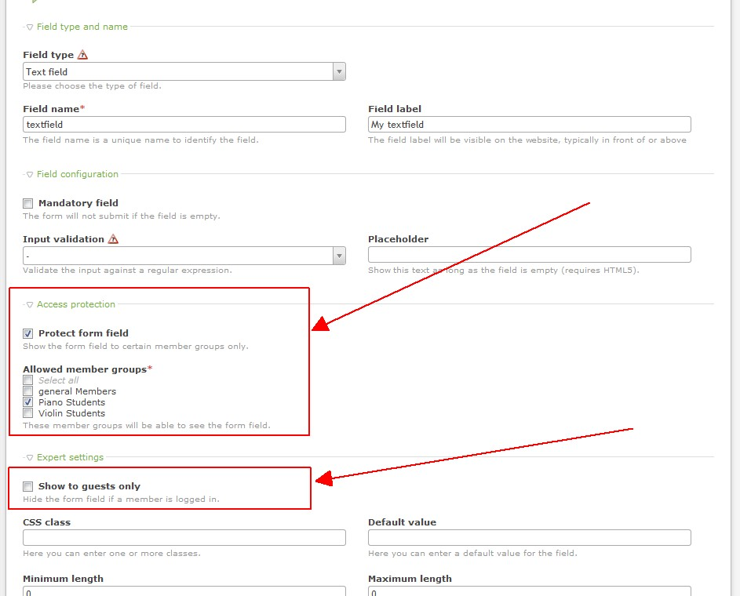

Contao Extension: FormFieldAccessProtection
===========================================

Provides access protection (known from modules and content elements) for form fields.

Installation
------------

Install the extension via composer: [cliffparnitzky/form-field-access-protection](https://packagist.org/packages/cliffparnitzky/form-field-access-protection).

If you prefer to install it manually, download the latest release here: https://github.com/cliffparnitzky/FormFieldAccessProtection/releases

Tracker
-------

https://github.com/cliffparnitzky/FormFieldAccessProtection/issues

Compatibility
-------------

- min. Contao version: >= 4.9

Dependency
----------

There are no dependencies to other extensions, that have to be installed.

Screenshots
-----------

